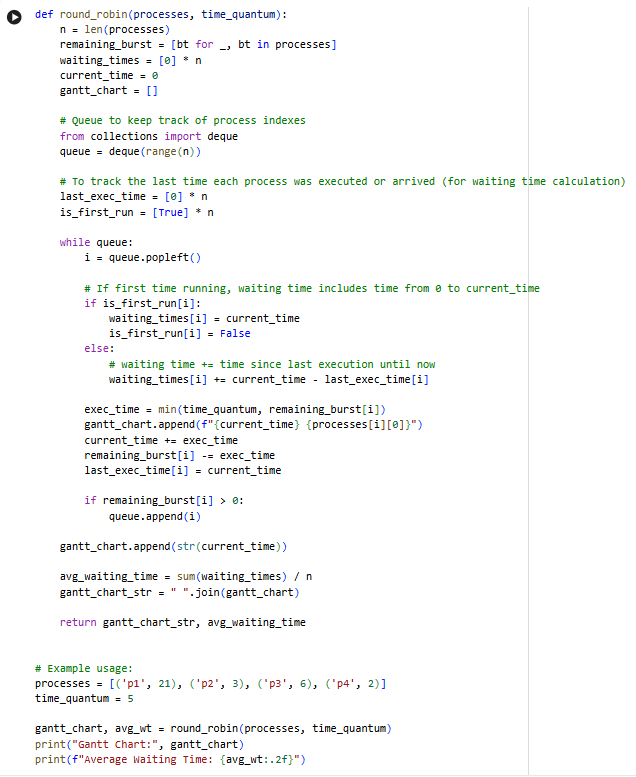

<div align="center">

# 🚀 Round Robin CPU Scheduling Simulator

### Round Robin Scheduling Algorithm Implementation in Python

[](https://www.python.org/)
[](LICENSE)
[](https://colab.research.google.com/github/tausif112/Round-Robin-CPU-Scheduling-Simulator/blob/main/RoundRobin.ipynb)

<br>

A Python implementation of the **Round Robin CPU Scheduling Algorithm** with Gantt Chart generation and Average Waiting Time calculation.

</div>

---

## 📌 Overview

This project demonstrates the implementation of the **Round Robin (RR) CPU Scheduling Algorithm**, one of the most widely used scheduling techniques in time-sharing operating systems.

Each process receives a fixed CPU time slice known as a **Time Quantum**.

If a process does not finish within its allocated quantum, it is moved back to the ready queue and waits for its next turn.

The project was developed and tested using **Google Colaboratory (Google Colab)**.

---

## ✨ Features

* Round Robin Scheduling Simulation
* Configurable Time Quantum
* Waiting Time Calculation
* Average Waiting Time Calculation
* Gantt Chart Generation
* Queue-Based Process Management
* Google Colab Notebook Included

---

## 🧠 About Round Robin Scheduling

Round Robin Scheduling is a preemptive CPU scheduling algorithm.

Each process receives CPU time in cyclic order.

### Advantages

* Fair CPU allocation
* Suitable for time-sharing systems
* Prevents process starvation
* Responsive for interactive systems

### Limitations

* Performance depends on Time Quantum
* Excessive context switching if quantum is too small
* Larger turnaround time if quantum is too large

---

## ⚙️ Algorithm

1. Initialize a ready queue.
2. Assign a fixed Time Quantum.
3. Execute the first process for one quantum.
4. If the process completes, remove it.
5. Otherwise, place it at the end of the queue.
6. Continue until all processes finish.
7. Calculate Waiting Time and Average Waiting Time.
8. Generate the Gantt Chart.

---

## 🧮 Input Example

```python
processes = [
    ('P1', 21),
    ('P2', 3),
    ('P3', 6),
    ('P4', 2)
]

time_quantum = 5
```

---

## 📊 Output Example

```text
Gantt Chart: 0 P1 5 P2 8 P3 13 P4 15 P1 20 P3 21 P1 26 P1 31 P1 32

Average Waiting Time: 9.50
```

---

## 📈 Gantt Chart Representation

```text
0     5    8    13   15   20   21   26   31   32
| P1 | P2 | P3 | P4 | P1 | P3 | P1 | P1 | P1 |
```

---

## 📸 Google Colab Development Environment

The project was implemented and tested using Google Colaboratory.

### Google Colab Workspace



---

## 📸 Program Output


---

## 📂 Project Structure

```text
Round-Robin-CPU-Scheduling-Simulator/
│
├── RoundRobin.ipynb
├── round_robin.py
├── README.md
├── LICENSE
├── .gitignore
│
└── screenshots/
    ├── colab-workspace.png
    └── output.png
```

---

## 🚀 How to Run

### Clone Repository

```bash
git clone https://github.com/tausif112/Round-Robin-CPU-Scheduling-Simulator.git
```

### Move to Project Folder

```bash
cd Round-Robin-CPU-Scheduling-Simulator
```

### Run Program

```bash
python round_robin.py
```

---

## 🛠 Technologies Used

| Technology        | Purpose                 |
| ----------------- | ----------------------- |
| Python            | Core Implementation     |
| Google Colab      | Development Environment |
| GitHub            | Version Control         |
| Operating Systems | Scheduling Concepts     |

---

## 📋 Scheduling Parameters

| Parameter       | Value       |
| --------------- | ----------- |
| Algorithm       | Round Robin |
| Time Quantum    | 5           |
| Scheduling Type | Preemptive  |
| Language        | Python      |

---

## 🔮 Future Improvements

* Arrival Time Support
* Turnaround Time Calculation
* Response Time Calculation
* Dynamic Time Quantum
* Graphical Gantt Chart Visualization
* Interactive User Input
* Comparison with FCFS, SJF, and Priority Scheduling

---


## 👨‍💻 Author

### Md Tausif Uddin

Department of Computer Science & Engineering (CSE)  
University of Asia Pacific (UAP)

GitHub: https://github.com/tausif112

---

<div align="center">

⭐ If you found this project useful, consider giving it a star!

</div>
